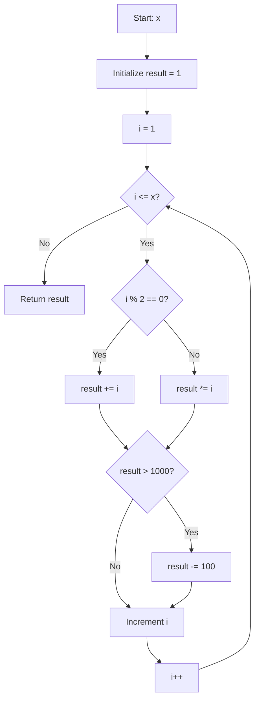
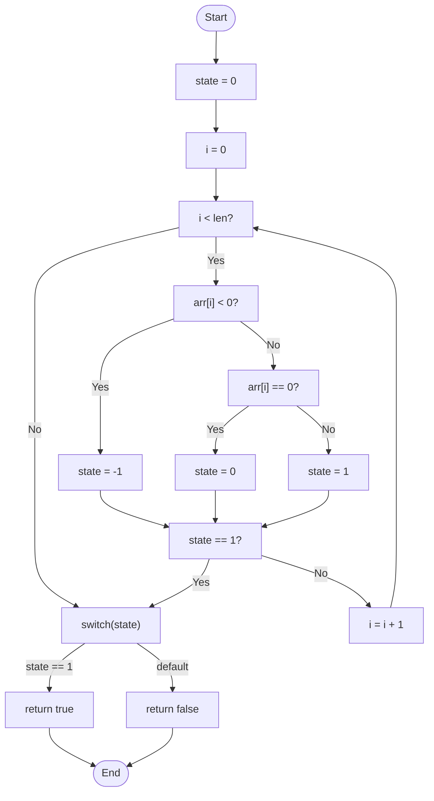

## Function 1: transform_complex

```mermaid
flowchart TD
  A[Start: x] --> B[Initialize result = 1]
  B --> C[i = 1]
  C --> D{i <= x?}
  D -- No --> E[Return result]
  D -- Yes --> F{i % 2 == 0?}
  F -- Yes --> G[result += i]
  F -- No --> H[result *= i]
  G --> I{result > 1000?}
  H --> I
  I -- Yes --> J[result -= 100]
  I -- No --> K[Increment i]
  J --> K
  K --> L[i++]
  L --> D
```

## Function 2: evaluate_sequence

```mermaid
flowchart TD
    Start(["Start"])
    InitState["state = 0"]
    InitI["i = 0"]
    CheckLoop["i < len?"]
    CheckNeg["arr[i] < 0?"]
    SetStateNeg["state = -1"]
    CheckZero["arr[i] == 0?"]
    SetStateZero["state = 0"]
    SetStatePos["state = 1"]
    CheckBreak["state == 1?"]
    IncrementI["i = i + 1"]
    SwitchState["switch(state)"]
    ReturnTrue["return true"]
    ReturnFalse["return false"]
    End(["End"])

    Start --> InitState --> InitI --> CheckLoop
    CheckLoop -- No --> SwitchState
    CheckLoop -- Yes --> CheckNeg
    CheckNeg -- Yes --> SetStateNeg
    CheckNeg -- No --> CheckZero
    CheckZero -- Yes --> SetStateZero
    CheckZero -- No --> SetStatePos
    SetStateNeg --> CheckBreak
    SetStateZero --> CheckBreak
    SetStatePos --> CheckBreak
    CheckBreak -- Yes --> SwitchState
    CheckBreak -- No --> IncrementI --> CheckLoop
    SwitchState -->|state == 1| ReturnTrue --> End
    SwitchState -->|default| ReturnFalse --> End
```
